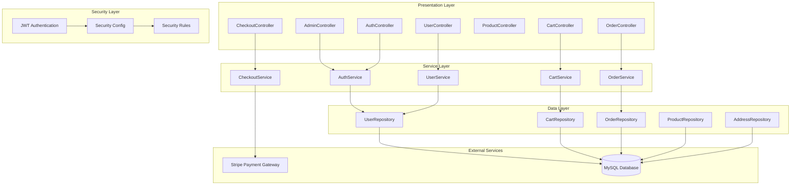
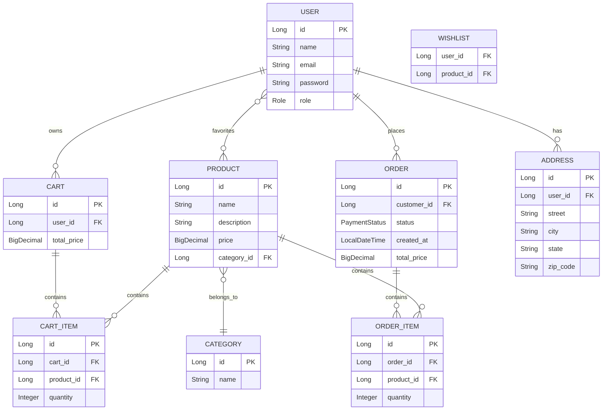
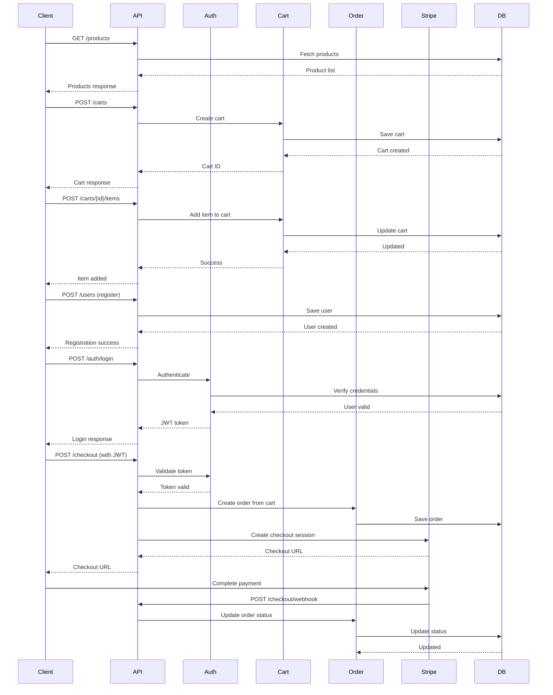

# Codebase Overview

This is a **Spring Boot e-commerce REST API** built with Java 21. It's a well-structured application following clean architecture principles with clear separation of concerns.

## Technology Stack
- **Framework**: Spring Boot 3.4.1
- **Language**: Java 21
- **Database**: MySQL with Flyway migrations
- **Security**: Spring Security with JWT authentication
- **Payment**: Stripe integration
- **Documentation**: OpenAPI/Swagger
- **Build Tool**: Maven
- **Additional**: Lombok, MapStruct, Thymeleaf

## Architecture Diagrams

### System Architecture



### Domain Model Diagram



### API Flow Diagram



## Package Structure

The application follows a **feature-based package structure**:

```
com.codewithmosh.store/
├── admin/          # Admin functionality
├── auth/           # Authentication & JWT
├── carts/          # Shopping cart management
├── common/         # Shared utilities & exceptions
├── orders/         # Order processing
├── payments/       # Stripe payment integration
├── products/       # Product catalog
└── users/          # User management
```

Each package contains:
- **Controller**: REST endpoints
- **Service**: Business logic
- **Repository**: Data access
- **Entity**: JPA entities
- **DTO**: Data transfer objects
- **Mapper**: Entity-DTO mapping
- **SecurityRules**: Authorization rules

## Key Features

1. **Product Management**: Browse products by category
2. **Shopping Cart**: Add/remove items, manage quantities
3. **User Management**: Registration, authentication, profiles
4. **Order Processing**: Convert carts to orders
5. **Payment Integration**: Stripe checkout and webhooks
6. **Security**: JWT-based authentication with role-based access
7. **API Documentation**: Swagger/OpenAPI integration

## Dependencies Analysis

### Core Spring Boot Dependencies
- `spring-boot-starter-web` - REST API capabilities
- `spring-boot-starter-data-jpa` - Database access
- `spring-boot-starter-security` - Authentication & authorization
- `spring-boot-starter-validation` - Input validation
- `spring-boot-starter-thymeleaf` - Template engine

### Database & Migration
- `mysql-connector-j` - MySQL database driver
- `flyway-core` & `flyway-mysql` - Database migrations

### Security & JWT
- `jjwt-api`, `jjwt-impl`, `jjwt-jackson` - JWT token handling
- `thymeleaf-extras-springsecurity6` - Thymeleaf security integration

### Utilities & Mapping
- `lombok` - Boilerplate code reduction
- `mapstruct` & `mapstruct-processor` - Entity-DTO mapping
- `spring-dotenv` - Environment variable management

### External Integrations
- `stripe-java` - Payment processing
- `springdoc-openapi-starter-webmvc-ui` - API documentation

## Database Schema

The application uses Flyway migrations with the following key tables:
- `users` - User accounts with roles
- `products` & `categories` - Product catalog
- `carts` & `cart_items` - Shopping cart functionality
- `orders` & `order_items` - Order management
- `addresses` - User shipping addresses
- `wishlist` - User favorite products

The codebase demonstrates solid Spring Boot practices with clean separation of concerns, proper exception handling, and comprehensive security implementation.